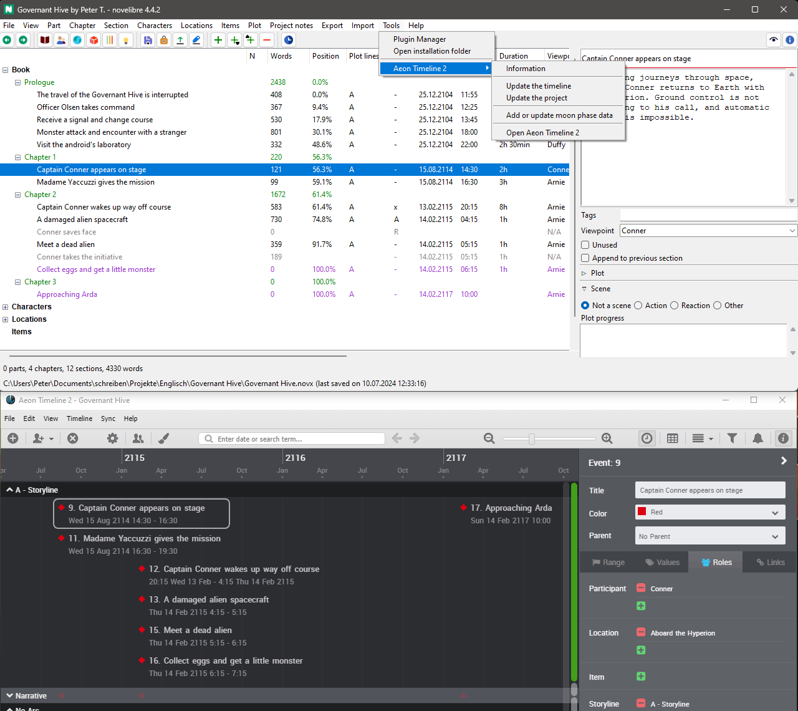

#  nv_aeon2

The [novelibre](https://github.com/peter88213/novelibre/) Python program helps authors organize novels.  

The *nv_aeon2* plugin synchronizes novelibre projects with Aeon Timeline 2.

The plugin adds an **Aeon Timeline 2** submenu to the *novelibre* **Tools** menu and a 
 button to the toolbar.

## Features

- Open the project timeline with the Aeon Timeline 2 application.

### Create a new novelibre project from a timeline

- Transfer "Narrative" sections with date, time, duration, description, tags, and relationships.
- Create characters, locations, items, and arcs are created.

### Update an existing novelibre project from a timeline

- Update section date, time, duration, description, tags, and relationships.
- Missing sections, characters, locations, and items are created.
- Sections are marked "unused" if the associated event is deleted in Aeon.

### Update an existing timeline from a novelibre project

- Update event date, time, duration, description, tags, and relationships.
- Entity types "Arc", "Character", "Location", and "Item", and a *Narrative* arc are created, if missing.
- Event properties "Description" and "Notes" are created, if missing.
- Missing events, characters, locations, and items are created.
- "Narrative" events are removed if the associated section is deleted in novelibre.

### Create a new timeline from a novelibre project

- Just update an empty timeline from a novelibre project.

### Add/update moon phase data

- For each event in the timeline, the moon phase can be added as a property.

## Requirements

- Aeon Timeline 2 
- [novelibre](https://github.com/peter88213/novelibre/) version 5.18+

## Download and install

### Default: Executable Python zip archive

Download the latest release [nv_aeon2_v5.2.3.pyzw](https://github.com/peter88213/nv_aeon2/raw/main/dist/nv_aeon2_v5.2.3.pyzw)

- Launch *nv_aeon2_v5.2.3.pyzw* by double-clicking (Windows/Linux desktop),
- or execute `python nv_aeon2_v5.2.3.pyzw` (Windows), resp. `python3 nv_aeon2_v5.2.3.pyzw` (Linux) on the command line.

#### Important

Many web browsers recognize the download as an executable file and offer to open it immediately. 
This starts the installation.

However, depending on your security settings, your browser may 
initially  refuse  to download the executable file. 
In this case, your confirmation or an additional action is required. 
If this is not possible, you have the option of downloading 
the zip file. 

### Alternative: Zip file

The package is also available in zip format: [nv_aeon2_v5.2.3.zip](https://github.com/peter88213/nv_aeon2/raw/main/dist/nv_aeon2_v5.2.3.zip)

- Extract the *nv_aeon2_v5.2.3* folder from the downloaded zipfile "nv_aeon2_v5.2.3.zip".
- Move into this new folder and launch *setup.pyw* by double-clicking (Windows/Linux desktop), 
- or execute `python setup.pyw` (Windows), resp. `python3 setup.pyw` (Linux) on the command line.

---

## Installing the Aeon Timeline 2 custom template
----------------------------------------------

After installation, you can copy a "novelibre.xml" template to the
*Aeon Timeline 2* custom template folder. The easiest way is to create new
timelines based on this template. It provides the entities and event
properties that are converted to *novelibre* by default.

You find the customized template in the *novelibre* installation directory under

`c:\Users\<user name>\.novx\nv_aeon2_sample\`

Just copy it into

`AppData\Local\Scribble Code\Aeon Timeline 2\CustomTemplates`.

** Hint:**
- The `<your user name>\AppData` folder is hidden, so you
  might have to go to the *Explorer* settings first to
  enable *Show hidden files*. Just disable this again after
  successfully having installed the custom template.
    
The next time you start *Aeon Timeline 2*,
the new template appears in the *Custom Templates* area.

---

[Changelog](docs/changelog.md)

## Usage and conventions

See the [online manual](https://peter88213.github.io/nv_aeon2/help/)

---

## Credits

- The logo is made using the free *Pusab* font by Ryoichi Tsunekawa, [Flat-it](http://flat-it.com/).
- The toolbar icons are based on the [Eva Icons](https://akveo.github.io/eva-icons/#/), published under the [MIT License](http://www.opensource.org/licenses/mit-license.php). The original black and white icons were colored for this plugin by the maintainer. 

## License

This is Open Source software, and the *nv_aeon2* plugin is licensed under GPLv3. See the
[GNU General Public License website](https://www.gnu.org/licenses/gpl-3.0.en.html) for more
details, or consult the [LICENSE](https://github.com/peter88213/nv_aeon2/blob/main/LICENSE) file.

